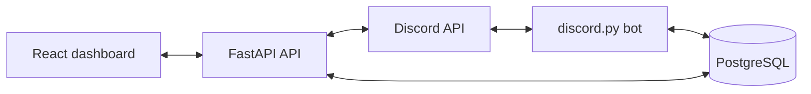

# Modular Discord Dashboard Bot

A self-hostable, modular Discord bot inspired by moderation/utility bots like
Dyno, built for extension in Python. The v0.1 foundation includes a Discord bot,
FastAPI API, React dashboard, PostgreSQL persistence, Docker deployment, and a
reference module layout for future features.

## Architecture



Each feature lives in `app/modules/<name>/`:

- `cog.py` for Discord interactions.
- `routes.py` for FastAPI endpoints.
- `models.py` for SQLAlchemy tables.
- `schemas.py` for Pydantic API contracts.
- `service.py` for business logic shared by bot and dashboard.
- `frontend/` for module-owned React pages/components.

The bot auto-discovers `app/modules/*/cog.py`; the API auto-mounts
`app/modules/*/routes.py`.

## Setup

1. Create a Discord application and bot in the Discord Developer Portal.
2. Add this OAuth redirect URI:

   ```text
   http://localhost:8000/auth/discord/callback
   ```

   For production, register:

   ```text
   https://api.example.com/auth/discord/callback
   ```

3. Copy `.env.example` to `.env` and fill in secrets.
4. Run:

   ```bash
   docker compose up --build
   ```

5. Open `http://localhost:5173`.

## Environment Variables

See `.env.example` for the full list. The key production domain values are:

- `WEB_DOMAIN=https://dashboard.example.com`
- `API_DOMAIN=https://api.example.com`
- `COOKIE_DOMAIN=.example.com`
- `CADDY_WEB_HOST=dashboard.example.com`
- `CADDY_API_HOST=api.example.com`
- `DISCORD_REDIRECT_URI=https://api.example.com/auth/discord/callback`

In production, CORS is restricted to `WEB_DOMAIN`. Local development also allows
`http://localhost:5173`. Session cookies are signed server-side by a random
session id, with Discord OAuth tokens stored in Postgres rather than exposed to
the browser. State-changing API routes require a double-submit CSRF token.

If Discord OAuth is unavailable, set `LOCAL_ADMIN_USERNAME`,
`LOCAL_ADMIN_PASSWORD`, and `LOCAL_ADMIN_GUILDS` to enable the password login on
the dashboard. `LOCAL_ADMIN_GUILDS` uses comma-separated `guild_id:Display Name`
entries and grants that local account dashboard access to those servers.

## Development

```bash
uv sync
uv run alembic upgrade head
uv run uvicorn app.web.app:create_app --factory --reload
uv run python -m app.bot.main
```

Frontend:

```bash
cd frontend
npm install
npm run dev
```

Checks:

```bash
uv run ruff format .
uv run ruff check .
uv run pytest
cd frontend && npm run build
```

## Production

Set the production `.env` values and run:

```bash
docker compose -f docker-compose.prod.yml up --build -d
```

`docker-compose.prod.yml` runs Caddy in front of the API and dashboard for
automatic HTTPS certificates.

## Forms / Applications

The Forms module is the v0.1 reference feature. Admins can create per-server
forms in the dashboard, define ordered fields, configure reviewer roles, set a
private review-thread parent channel, publish the Apply button, and view
submissions by status.

Reviewer roles can approve, deny, and request more information. Viewer roles can
be added separately so officers can see and discuss review threads without
having permission to use the decision buttons.

Admins can also create a starter form directly in Discord with `/forms setup`.
The command uses Discord channel and role pickers, creates required long-text
questions, saves the form, and immediately posts the Apply button in the chosen
channel. Use the dashboard afterward for deeper edits, extra field types, custom
DM messages, and submission review.

When a member clicks Apply, the bot opens Discord modal pages in chunks of five
fields, stores the answers in Postgres, creates a private review thread, posts a
review embed, and pings the configured reviewer roles once. Approving a
submission DMs the applicant, optionally grants the configured role, and deletes
the review thread. Reviewer buttons use stable custom IDs and are re-registered
on startup.

## Roadmap

- v0.1: Project foundation, Discord OAuth dashboard login, module discovery,
  hello cog, Forms / Applications module.
- v0.2: Moderation cog with dashboard-managed automod rules.
- v0.3: Audit log viewer and configurable Discord event logging.
- v0.4: Welcome screen and auto-role module.
